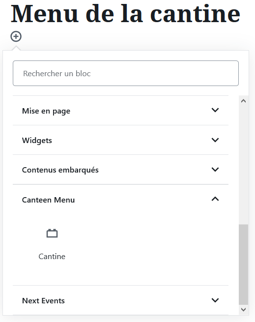
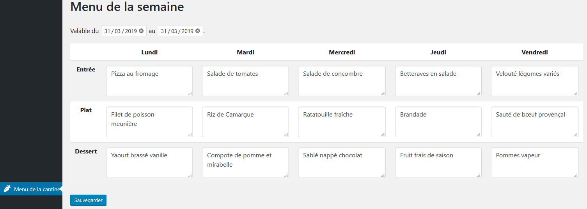
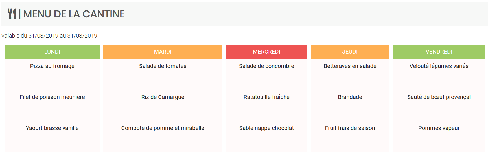

Canteen Menu is a Wordpress plugin who add a canteen menu for a week.
This plugin was mainlly made for schools.

⚠️ Warning : This theme work on WordPress 5.0+ ⚠️

## Installation

### Step 1 - Install the plugin

1) First of all, go into your website FTP
2) Go inside wp-content > themes
3) Download the plugin

Download the [zip file](https://github.com/qanastek/Next-Events/archive/master.zip) from GitHub.

or

```bash
Git clone https://github.com/qanastek/Next-Events.git
```

4) If you download the zip file, extract it here

## Setup the canteen menu

Use the block:



or

Use the shortcode :
```php
[CanteenMenu]
```

or

Use the php function :
```php
echo do_shortcode("[CanteenMenu]");
```

## Make your own canteen menu

* Go to the "menu de la cantine" in the WordPress side bar
* Fill up the fields
* Save

## Pictures

### Admin side



### User side


